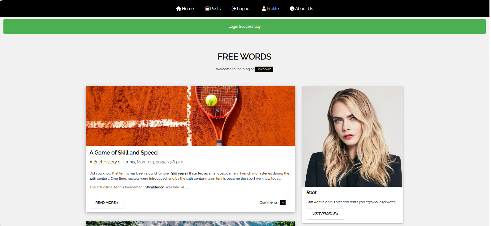
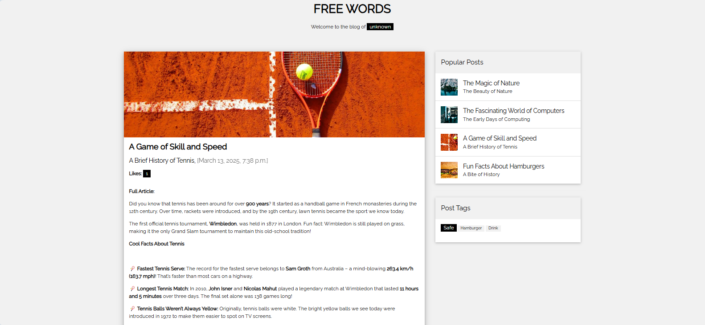
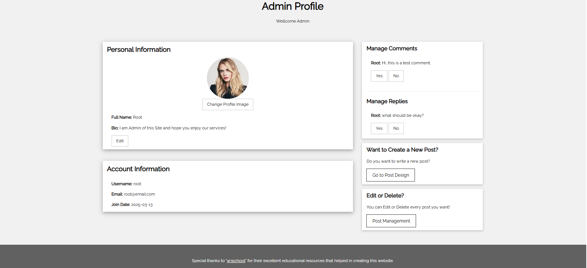
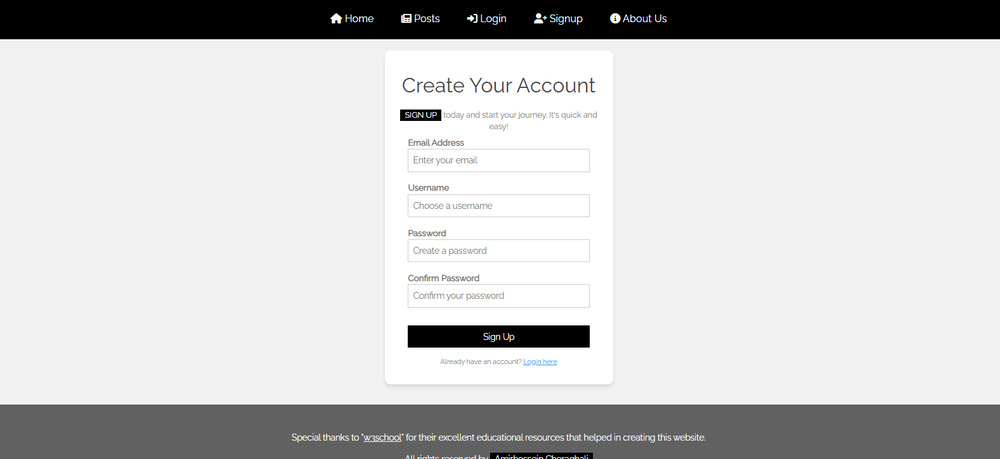

# FREEWORDS

**FREEWORDS** is a modern blog platform with a Django backend and a JavaScript + W3.CSS frontend. It combines simplicity with powerful features, enabling users to engage with content, manage profiles, and interact with posts through likes, comments, and replies.

---

## 🚀 Key Features
- **User Authentication & Registration**: Free sign-up, login, logout, and password recovery via email.
- **User Profiles**: Customizable profiles with profile picture and bio.
- **Post Creation & Interaction**:
  - Admins and users can create posts.
  - Posts include cover image, title, body, creation date, and tags.
  - Users can like posts, add comments, and reply to comments.
  - Edit or delete comments and replies.
- **Comment System**: Admin approval required before publishing.
- **Popular & Recent Posts**: Display based on likes or newest creation date.
- **Search Functionality**: Search posts by title, content, or tags.
- **Admin Features**: Post management, comment moderation, and platform control.

---

## 🛠️ Architecture & Technologies
- **Django MVC structure**: Views, Templates, URLs, Models.
- **PostgreSQL** as the database.
- **Redis** for caching to reduce database load.
- **Dockerized**: The entire application runs inside Docker containers.
- **Cloud Storage**: Integrated for image hosting.
- **RabbitMQ + Celery**: Used for asynchronous image uploads to cloud storage, improving user experience.
- **Testing**: Fully tested with both **pytest** and **unittest**.

---

## 📦 Installation
```bash
# Clone the repository
git clone https://github.com/your-username/freewords.git
cd freewords

# Create and activate virtual environment (optional if not using Docker)
python -m venv venv
source venv/bin/activate   # On Windows: venv\Scripts\activate

# Install dependencies
pip install -r requirements.txt

# Apply migrations
python manage.py migrate

# Run development server
python manage.py runserver
```

### Run with Docker
```bash
# Build and start the containers
docker-compose up --build

# Stop the containers
docker-compose down
```

---

## 🧪 Testing
Run the test suite with either **pytest** or **unittest**:
```bash
# Using pytest
pytest

# Using unittest
python -m unittest discover
```

---

## 📸 Screenshots
You can view the weblog environment.







---

## 🔮 Future Features
- User-generated content for more dynamic interactions.
- Enhanced notifications for posts, likes, comments, and replies.
- Improved search algorithms for better discovery.

---

## 📜 License
This project is licensed under the **MIT License**. See the [LICENSE](LICENSE) file for details.

